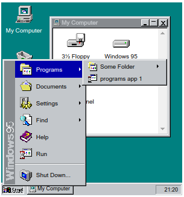

This is a WIP thing which will go on my resume site, holding my portfolio, resume, etc as files and programs within a win95 UI. Mostly working right now, but with boring placeholder data.

1. yarn
1. yarn start
1. http://localhost:8080

